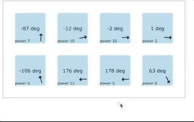

# aim

A Vanilla JS library that anticipates on which element user is going to hover or click.

The gif animation and algorithm concept is from https://github.com/cihadturhan/jquery-aim



## Size

UMD minified 4.7kb, gzipped minified 1.9kb

## Demo

https://s.codepen.io/kunukn/debug/690fb382ae6450c8bf14ad9909a60df2

## Getting started

`npm i @kunukn/aim`<br>
or<br>
`yarn add @kunukn/aim`

## Usage

Call the function on the `querySelectorAll string` to catch user aim and add a class which will be added or removed when aiming starts or ends.

```javascript
import aim from "@kunukn/aim";

// Target all elements who has a class name of target
aim({
  target: ".target",
  className: "open"
});

aim.start(); // start the aim library, you only need to run this once.
```

Call the function on the element to catch user aim and add a class which will be added or removed when aiming starts or ends.

```javascript
// Target by DOM element
aim({
  target: document.querySelector("#my-element"),
  className: "open"
});

aim.start(); // start the aim library
```

Call the function on the object to catch user aim for that area.

```js
// Target by manual data
aim({
  target: { x: 10, y: 10, width: 200, height: 200 },
  aimEnter: () => console.log("target enter")
});

// Target by manual data, full width example
aim({
  target: { y: 10, width: "100%", height: 200 },
  aimEnter: () => console.log("target enter")
});

aim.start(); // start the aim library
```

If you want to execute a function on aim starts or ends, use the `aimEnter` and `aimExit` options

```javascript
let menu = document.querySelector("#menu");
let id = aim({
  target: "#hamburger",
  aimEnter: function() {
    menu.style.display = "block";
    console.log(this); // the hamburger element
  },
  aimExit: function() {
    menu.style.display = "none";
  }
});

aim.start();
```

## CDN

https://unpkg.com/@kunukn/aim/

## Supported browsers

IE11 + Modern browsers

## Debugging

To see where your cursor is aiming and check if it intersects with elements use

```javascript
aim.setDebug(true);
```

You will need to add CSS for the debug object.

```html
<style>
  #__aim-debug {
    position: fixed;
    top: 0;
    left: 0;
    border: 2px solid #333;
    opacity: 0.3;
    background-color: yellowgreen;
    pointer-events: none;
  }
  #__aim-debug.__aim-debug--hit {
    background-color: purple;
  }
  #__aim-debug.__aim-debug--hit-2 {
    background-color: tomato;
  }
</style>
```

Then you will see a rectangle moving around.

## Other methods

Increase or decrease the hit area

`aim.setAnticipator({size: 100}) // default value is 50`

Stop the library and the event listeners

`aim.stop()`


Tell the library to update it's internal information of where the element is positioned.

`aim.updatePosition(target)`

Target can either be

- `"dom"` which updates all the DOM elements positions.
- a DOM element
- an object with id `{id: 'the-given-id-when-the-target-was-added', x, y, width, height}`

Remove all targets.

`aim.removeAll()` 

Remove the target.

`aim.remove(target)` 

Target can either be

- DOM element
- and object with an id

## Development

- git clone the project
- yarn install
- use a modern browser like Chrome or Firefox

### start dev mode

`yarn dev`

### smoke test the compiled library

`yarn start`

### build

`yarn build`

## Learning materials

If you want to learn how to implement tracking algorithm like this. Then I recommend to explore this resource:
https://natureofcode.com/book/chapter-1-vectors/
